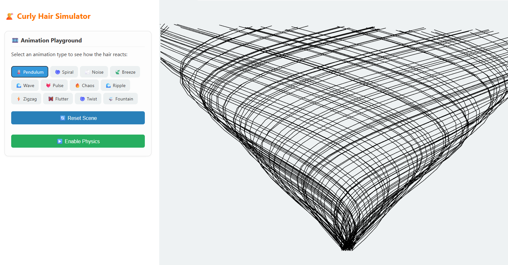

# Curly-Cue Web

**Curly-Cue Web** is an interactive web interface for the geometric reconstruction and procedural generation of curly hair strands based on the pipeline described in the paper [*Curly-Cue: Curly Hair Geometry from a Single View* (SIGGRAPH 2024)](https://theodorekim.com/curlycue.html) by Theodore Kim et al.

This project encapsulates the entire pipeline within a service-oriented architecture, exposing a REST API and a real-time 3D viewer. Users can upload scalp meshes and guide hairs, configure parameters such as strand density and curliness, and generate styled `.obj` outputs with material files.

## ✨ Features

- Modern web interface for 3D hair visualization.
- FastAPI backend with endpoints for:
  - Uploading scalp meshes and guide strands.
  - Configuring parameters like strand length, curliness, density, and color.
  - Generating `.obj` files with `.mtl` materials.
- Real-time WebGL viewer with optional physics simulation.
- Predefined style presets and interactive parameter control.

## 🗂 Project Structure

```
curly-cue-web/
├── api.py              # FastAPI backend for generation and file handling
├── data/               # Example inputs and pre-generated strand files
├── web/                # Frontend app (React + Vite)
│   ├── index.html
│   └── src/
├── swatchExample.sh    # Example script for generating a full hair swatch
└── README.md
```

## ⚙️ Requirements

- **Python 3.10+**
- **Node.js 18+**
- Recommended: use a virtual environment (e.g., `venv`, `conda`)

## 🚀 Installation

1. **Clone the repository:**

```bash
git clone https://github.com/your-username/curly-cue-web.git
cd curly-cue-web
```

2. **Install Python dependencies:**

```bash
pip install -r requirements.txt
```

3. **Start the FastAPI backend:**

```bash
uvicorn api:app --reload
```

4. **Install and run the frontend:**

```bash
cd web
npm install
npm run dev
```

The web interface will be available at `http://localhost:5173` and communicates with the API at `http://localhost:8000`.

## 📸 Screenshots

### App.tsx


### Physics.tsx


## 🧪 Example Data

The `data/` folder includes:

- `guide_strands/`: guide hair examples (OBJ format)
- `full_strands/`: complete generated strand outputs
- `amp_angle_stats/`: strand curvature and angular statistics

These can be used to test the pipeline or reproduce the figures in the original paper.

## 💇 Hair Generation Pipeline

The system supports:

- Uploading custom input geometries
- Generating realistic 3D strands with controllable parameters
- Exporting `.obj + .mtl` files for use in other 3D software
- Visualizing hair with dynamic animations (wind, droop, gravity)

## 🔁 Quick Test

Run the sample script:

```bash
./swatchExample.sh
```

This generates a full hair swatch using the provided examples and saves the output in the `data/` directory.

## 📚 Reference

Kim, T., et al. *Curly-Cue: Curly Hair Geometry from a Single View*. ACM Transactions on Graphics (TOG), SIGGRAPH 2024.  
[https://theodorekim.com/curlycue.html](https://theodorekim.com/curlycue.html)


